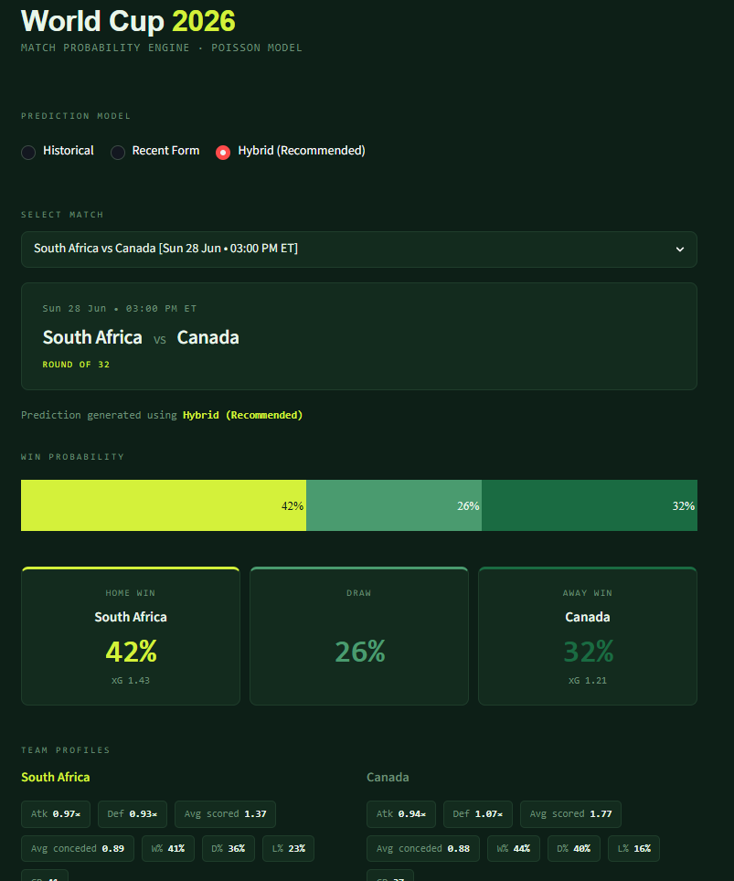

# World Cup 2026 Predictor ⚽


# ⚽ FIFA World Cup 2026 Predictor & Bracket Engine

[](YOUR_DEPLOYED_APP_URL_HERE)
A production-style football analytics platform for predicting FIFA World Cup matches using a hybrid statistical engine that combines historical World Cup performance, recent international form, competition weighting, exponential recency decay, and Poisson goal simulation.

The prediction engine ingests more than **39,000 international matches**, applies competition-specific weighting, exponential recency decay, blends historical World Cup performance with recent international form, and generates match probabilities using a Poisson goal model.

The project includes automated data ingestion, SQLite database management, statistical backtesting, knockout-stage fixture management, and a fully interactive Streamlit dashboard.

The architecture is designed around modular ingestion pipelines, reusable statistical components, and automated tournament updates, allowing new World Cup stages to be incorporated without modifying application code.

**[Live app →](https://world-cup-predictor-wjww6fmrzy7nzefe8epety.streamlit.app)**



---

## What it does

The project provides:

- Match outcome prediction
- Exact scoreline probabilities
- Team attack and defensive ratings
- Historical World Cup analytics
- Recent international form analytics
- Hybrid statistical predictions
- Interactive Streamlit dashboard

---
## Project Statistics

- **39,000+** international matches analyzed
- **90+ years** of World Cup history
- **223** international teams supported
- **3** statistical prediction engines
- **Poisson goal simulation**
- **SQLite-backed architecture**
- **Automated backtesting framework**
- **Interactive Streamlit dashboard**
---

## Current Features

- Historical World Cup prediction engine (1994–2022)
- Recent international form model (~39,000 matches)
- Hybrid prediction engine
- Competition-specific weighting
- Exponential recency weighting
- Automated fixture ingestion
- SQLite-backed architecture
- Streamlit dashboard
- Team profile analytics
- Goal probability heatmaps
- Exact scoreline probabilities
- Historical backtesting framework
- Round of 32 support
- Automatic Eastern Time fixture display

## Core Technologies

- Python 3.13
- SQLite
- Streamlit
- Plotly
- NumPy
- SciPy
- Pandas
- SQLAlchemy
- Poisson Goal Model
- Statistical Backtesting

## How the Model Works

The prediction engine combines two independent statistical models before generating match probabilities.

```text
Historical World Cup Matches
                │
                ▼
      Historical Ratings
                │
                │
International Results (39,000+)
                │
                ▼
     Competition Weighting
                │
                ▼
        Recency Decay
                │
                ▼
       Recent Form Ratings
                │
                ▼
     Hybrid Rating Engine
                │
                ▼
       Expected Goals (xG)
                │
                ▼
      Poisson Goal Simulation
                │
                ▼
 Win / Draw / Loss Probabilities
 Exact Scoreline Matrix
 Goal Heatmaps
```

## Historical Model

Built exclusively from FIFA World Cup matches between 1994 and 2022.

Captures:

- Historical attack strength
- Historical defensive strength
- Tournament experience
- Long-term World Cup performance

---

## Recent Form Model

Built from approximately **39,000 international fixtures**.

Includes:

- FIFA World Cup
- FIFA World Cup Qualifiers
- UEFA Nations League
- CONCACAF Nations League
- Continental Championships
- International Friendlies

Competition importance and exponential recency weighting ensure that recent competitive matches contribute significantly more than older or lower-value fixtures.

---

## Hybrid Rating Engine

The final prediction model blends historical World Cup performance with recent international form.

Current weighting:

- Historical World Cup: **40%**
- Recent International Form: **60%**

These values are optimized through statistical backtesting.

---

## Expected Goals

For each fixture:

```text
λ_home = Global Average × Home Attack × Away Defense

λ_away = Global Average × Away Attack × Home Defense
```

---

## Poisson Goal Simulation

Expected goals are converted into scoreline probabilities using independent Poisson distributions.

The engine computes:

- Win probability
- Draw probability
- Loss probability
- Expected goals
- Goal probability matrix
- Most likely scorelines

### Historical Model

Built from World Cup matches between 1994 and 2022.

Captures:

- World Cup experience
- Tournament performance
- Historical attack strength
- Historical defensive strength

### Recent Form Model

Built from approximately 39,000 international fixtures.

Includes:

- FIFA World Cup
- FIFA World Cup Qualifiers
- UEFA Nations League
- CONCACAF Nations League
- Continental Championships
- Friendlies

Recent matches receive exponentially larger weights than older matches.

### Hybrid Model

The final prediction engine blends both models.

Current weighting:

Historical World Cup: 40%

Recent Form: 60%

Weights are validated through automated backtesting.

---

## Backtest results

| Test season | Matches | Accuracy | Log Loss | Brier Score |
|-------------|---------|----------|----------|-------------|
| WC 2022     | 59      | 59.3%    | 1.044    | 0.201       |
| WC 2018     | 64      | 53.1%    | 1.044    | 0.206       |

**Calibration (WC 2022):**

| Model confidence | Actual win rate | Delta |
|-----------------|-----------------|-------|
| 50–60%          | 50.0%           | −6.7% |
| 60–70%          | 60.0%           | −4.1% |
| 70–80%          | 71.4%           | −1.6% |
| 80–90%          | 33.3%           | −51%  |

The model is well-calibrated up to 80% confidence. The 80–90% bucket shows overconfidence — it had 3 matches in that range and called 2 of them wrong, including Argentina vs Saudi Arabia and Brazil vs Cameroon. Small sample, but worth noting.

**Baseline comparison (WC 2022):**

| Model                    | Log Loss | Brier  |
|--------------------------|----------|--------|
| Poisson (this model)     | 1.044    | 0.201  |
| Uniform (33/33/33)       | 1.099    | 0.222  |
| Home-favoured (40/30/30) | 1.063    | 0.214  |

The model beats every naive baseline on both tournaments.

---

## Project Structure

```text
world-cup-predictor/
│
├── app.py
├── math_engine.py
├── backtest.py
├── ingest_api.py
├── ingest_form.py
├── ingest_fixtures.py
├── predictor.db
├── data/
│   ├── Matches.csv
│   ├── WorldCupMatches.csv
│   ├── results.csv
│   └── fixtures_2026.csv
├── docs/
│   └── screenshots/
├── requirements.txt
└── README.md
```
## System Architecture

The application is split into four discrete layers. Each layer has a single responsibility and communicates through well-defined interfaces — the data pipeline never touches the UI, and the math engine never touches the database directly.

```
┌─────────────────────────────────────────────────────────┐
│                     DATA LAYER                          │
│                                                         │
│  Kaggle CSVs          Football-Data API                 │
│  (1930–2022)          (live fixtures)                   │
│       │                      │                          │
│       ▼                      ▼                          │
│  ingest_form.py       ingest_api.py                     │
│  ingest_fixtures.py                                     │
│       │                      │                          │
│       └──────────┬───────────┘                          │
│                  ▼                                      │
│            predictor.db  (SQLite)                       │
└──────────────────┬──────────────────────────────────────┘
                   │
┌──────────────────▼──────────────────────────────────────┐
│                  MATH ENGINE                            │
│                                                         │
│  math_engine.py                                         │
│                                                         │
│  Historical ratings  ──┐                                │
│  Competition weights   ├──► Hybrid Rating               │
│  Recency decay       ──┘         │                      │
│                                  ▼                      │
│                     λ_home / λ_away  (Expected Goals)   │
│                                  │                      │
│                                  ▼                      │
│                     Poisson Simulation                  │
│                     Win / Draw / Loss                   │
│                     Scoreline Matrix                    │
└──────────────────┬──────────────────────────────────────┘
                   │
┌──────────────────▼──────────────────────────────────────┐
│                SERVICE LAYER                            │
│                                                         │
│  prediction_service.py    fixture_service.py            │
│  analytics_rating_service.py  team_service.py           │
│  bracket_service.py       xg_service.py                 │
│  tournament_rating_service.py                           │
└──────────────────┬──────────────────────────────────────┘
                   │
┌──────────────────▼──────────────────────────────────────┐
│                PRESENTATION LAYER                       │
│                                                         │
│  app.py  (Streamlit entry point)                        │
│                                                         │
│  components/          assets/                           │
│  ├── bracket.py       ├── css.py   (design system)      │
│  ├── charts.py        ├── theme.py                      │
│  ├── match_card.py    └── flags/                        │
│  ├── prediction_breakdown.py                            │
│  └── team_card.py                                       │
│                                                         │
│  Custom CSS Grid  +  Dynamic SVG bracket connectors     │
└─────────────────────────────────────────────────────────┘
```

Data flows strictly downward. The math engine is stateless and functional — every service imports it as a pure computation layer, making it independently testable and reusable across backtesting and live prediction without modification.

---

## Setup

```bash
pip install -r requirements.txt

python ingest_form.py

python ingest_fixtures.py

streamlit run app.py
```

### Refresh Tournament Fixtures

Whenever a new knockout round begins:

1. Update `data/fixtures_2026.csv`
2. Run:

```bash
python ingest_fixtures.py
```

The Streamlit application will automatically display the latest fixtures without any database editing or code changes.
```bash
streamlit run app.py
```

### Run the backtest

```bash
# Train on 1930-2018, test on 2022 (default)
python backtest.py

# Custom split
python backtest.py --test-season 2018
```

---

## Deploying to Streamlit Cloud

1. Push your repo to GitHub (make sure `predictor.db` is committed — see note below)
2. Go to [share.streamlit.io](https://share.streamlit.io) and connect your repo
3. Set the main file to `app.py`
4. Add your API key as a secret: `FOOTBALL_DATA_API_KEY = "your_key"`

> **Note on the database file:** `predictor.db` needs to be committed to the repo for Streamlit Cloud to have access to it, since the cloud environment doesn't have local file persistence. The file is around 300KB so this is fine for now. For a production deployment you'd swap this for a hosted database.

---

## Tech Stack

| Layer | Technology |
|---|---|
| **Frontend** | Streamlit, Custom CSS design system, Dynamic SVG generation |
| **Backend** | Python 3.13, SQLite3 |
| **Data pipelines** | Football-Data.org API (automated ingestion), Kaggle historical CSVs |
| **Math / Statistics** | Poisson goal model, Exponential recency decay, Competition-weighted ratings |
| **Backtesting** | Custom out-of-sample validation framework |
| **Deployment** | Streamlit Community Cloud |
| **CI** | GitHub Actions (`test.yml`) |

---

## Requirements
```
Python 3.13+

streamlit

plotly

numpy

scipy

pandas

requests

sqlalchemy

sqlite3
```

```
streamlit>=1.28.0
plotly>=5.17.0
scipy>=1.11.0
numpy>=1.24.0
pandas>=2.0.0
requests>=2.31.0
sqlalchemy>=2.0.0
```

---

# Version 2 (Completed)

- [x] Historical World Cup prediction engine
- [x] Recent international form engine
- [x] Hybrid prediction model
- [x] Competition weighting
- [x] Exponential recency weighting
- [x] Automated fixture ingestion
- [x] Knockout stage support
- [x] Team analytics dashboard
- [x] Statistical backtesting
- [x] Eastern Time fixture conversion
- [x] Interactive Streamlit dashboard

---

# Version 3 (Completed)

- [x] Interactive knockout bracket
- [x] Automatic bracket progression
- [x] Dynamic SVG connector lines
- [x] Click-to-predict match selection
- [x] Winner highlighting across bracket
- [x] Custom CSS design system with variables
- [x] Flag rendering across all bracket cards
- [x] Third place match support
- [x] Modular service layer architecture
- [x] GitHub Actions CI pipeline

---

# Version History

## Version 1

- Historical World Cup Poisson model
- SQLite backend
- Streamlit interface

## Version 2

- Hybrid statistical engine
- 39,000+ international matches
- Competition weighting
- Exponential recency weighting
- Fixture ingestion pipeline
- Knockout stage support
- Interactive analytics
- Automated backtesting
- Eastern Time conversion

## Version 3

- Interactive SVG knockout bracket
- Click-to-predict match selection
- Automatic bracket progression
- Winner path highlighting
- Custom CSS design system
- Flag rendering
- Modular service architecture
- CI pipeline

---

# Version 4 Roadmap

- Monte Carlo tournament simulation
- Elo integration
- Bayesian rating system
- Dixon-Coles draw correction
- Prediction confidence metrics
- Calibration plots
- Team comparison dashboard
- Live FIFA rankings
- Squad valuation integration
- Injury impact modelling
- Live World Cup result ingestion
- Rolling multi-World Cup validation

---

# Future Improvements

Planned enhancements include:

- Monte Carlo tournament simulations
- Elo + Poisson ensemble model
- Bayesian strength updates
- Dixon-Coles draw correction
- Advanced expected goals modelling
- Prediction calibration dashboard
- Live fixture synchronization
- Squad valuation and injury modelling

### 1. Clone the repository

```bash
git clone https://github.com/Raj200727/world-cup-predictor.git
cd world-cup-predictor
```

### 2. Create and activate a virtual environment

```bash
python -m venv .venv

# macOS / Linux
source .venv/bin/activate

# Windows
.venv\Scripts\activate
```

### 3. Install dependencies

```bash
pip install -r requirements.txt
```

### 4. Configure your API key

Create the Streamlit secrets file:

```bash
mkdir -p .streamlit
touch .streamlit/secrets.toml
```

Add your key:

```toml
# .streamlit/secrets.toml
API_KEY = "your_football_data_api_key_here"
```

> The `.streamlit/` directory is already listed in `.gitignore`. Never commit this file.

### 5. Ingest historical and fixture data

```bash
# Load 39,000+ historical international results
python ingest_form.py

# Load 2026 World Cup fixture schedule
python ingest_fixtures.py

# (Optional) Pull live results from the Football-Data API
python ingest_api.py
```

This populates `predictor.db`. You only need to run the ingestion scripts once unless the source data changes.

### 6. Run the application

```bash
streamlit run app.py
```

The dashboard will open at `http://localhost:8501`.

### Updating fixtures as the tournament progresses

When a new knockout round begins, run:

```bash
python ingest_fixtures.py
```

The application reads directly from the database — no code changes required.

### Running the backtest

```bash
# Default: train on 1930–2018, evaluate on WC 2022
python backtest.py

# Custom test season
python backtest.py --test-season 2018
```

## Portfolio notes

If you're sharing this as a portfolio project, the things worth highlighting are:

1. **The full pipeline** — from raw CSV/API ingestion through a SQLite store, a modular prediction engine, an out-of-sample backtest framework, and a deployed Streamlit UI. Most toy ML projects show one piece; this shows all of them connected.

2. **The backtest methodology** — training strictly on data before the test season, never leaking future information, and comparing against baselines rather than just reporting accuracy in isolation. This is what separates a genuine evaluation from a number that looks good on a slide.

3. **The calibration analysis** — showing that the model is well-calibrated in the 50–80% range and identifying where it breaks down (the 80–90% overconfidence bucket) is more honest and more impressive than just claiming "59.3% accuracy."

4. **The architecture decisions** — the math engine is stateless and functional so every layer can import it cleanly. The backtest framework takes a config object and returns a report object, making it reusable for any train/test split. These aren't accidental — they're design choices worth talking about in an interview.

---

## Data sources

- **WC 1930–2018 match results:** [evangower/fifa-world-cup](https://www.kaggle.com/datasets/evangower/fifa-world-cup) on Kaggle
- **WC 2022 match results:** [swaptr/fifa-world-cup-2022-match-data](https://www.kaggle.com/datasets/swaptr/fifa-world-cup-2022-match-data) on Kaggle
- **WC 2026 fixture schedule:** [football-data.org](https://www.football-data.org/) free tier API
---

## License

MIT
